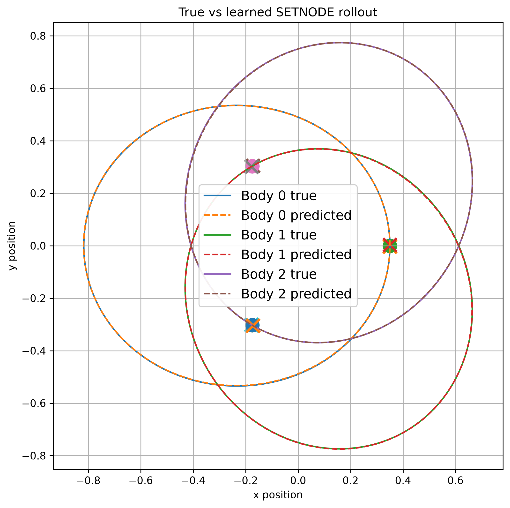

Please excuse the very messy, repeated, and unorganized code. This was created during an REU with deadlines and no time for refactoring. This project was a great learning experience on how to not write code!

# SETNODE: Spatial Equivariant Transformer Neural ODE

[Read the report (PDF)](SETNODE_report/SETNODE_Report.pdf) · [Report source and supporting records](SETNODE_report/README.md) · [Quick start](#quick-start)

## Overview

SETNODE learns particle dynamics from configurations of positions and masses. Its graph processor combines an unnormalized sum of interaction messages with locally centered attention, then predicts an invariant scalar potential. Differentiating this potential gives forces; dividing by mass gives accelerations, which velocity Verlet integrates into trajectories.

The idea is to combine additive aggregation with attention that can adjust to the current configuration. This repository studies that design on gravitational N-body systems and includes data generation, one-step training, rollout fine-tuning, evaluation, and 2D/3D visualization. Fluid and boundary interactions motivate future work; they are not demonstrated by the current experiments.

The force construction respects the symmetries of the learned potential. It does not guarantee exact conservation of the true gravitational energy during a numerically integrated rollout.

## Report and demonstration

**Trillyon Earl. _SETNODE: Spatial Equivariant Transformer Neural ODE for Physical Dynamics._** Unpublished NSF REU technical report, revised October 3, 2026.

- [Full report](SETNODE_report/SETNODE_Report.pdf)
- [Editable LaTeX source](SETNODE_report/SETNODE_Report.tex)
- [Report build instructions and archived evaluation records](SETNODE_report/README.md)



*Illustrative eccentric Lagrange rollout from the report, with reference and predicted trajectories overlaid. This example uses a later extended-readout model (`generic_ablation`) trained for approximately 12 hours. It is separate from the original six-model quantitative comparison.*

The report's quantitative study uses 3,000 two-dimensional three-body trajectories and evaluates one checkpoint per architecture on the same 50 held-out trajectories for 299 rollout transitions. These comparisons concern complete model-and-solver pipelines; they do not isolate attention's contribution.

## Models

Parameter counts below describe the checkpoints evaluated in the report, not the current command-line defaults.

| Model | Implementation | Learned output | Report parameters |
| --- | --- | --- | ---: |
| SETNODE | [`SETNODE/`](SETNODE/), `--model-variant baseline` | Invariant potential, differentiated into forces; additive and centered-attention branches | 114,514 |
| SETNODE extended readout | [`graph_network_ablation.py`](SETNODE/models/graph_network_ablation.py), `--model-variant generic_ablation` | Potential with scalar pair-score symmetrization, learned radial bases, input skips, and gated node/pair/global contributions | Configuration-dependent; separate illustrative experiments |
| EGNN-HNN | [`EGNN_HNN/`](EGNN_HNN/) | Invariant graph potential, differentiated into forces | 116,647 |
| EGNN | [`EGNS/`](EGNS/) | Acceleration from equivariant graph processing | 116,006 |
| GNS | [`GNS/`](GNS/) | Acceleration from graph processing with velocity, mass, and engineered edge features | 114,597 |
| HNN | [`HNN/`](HNN/) | Scalar potential from a dense network, differentiated into forces | 113,506 |
| MLP | [`MLP/`](MLP/) | Acceleration from flattened positions, velocities, and masses | 115,134 |

`EGNS` is the code and checkpoint name for the model labeled **EGNN** in the report. EGNN-HNN is a separate baseline, not an otherwise identical SETNODE with attention removed. These are project implementations of the model families, not exact reproductions of external benchmark configurations.

The original SETNODE checkpoint uses latent width 64, one interaction block, two attention heads, raw mass features, and force supervision. Current training also supports log-mass features and a combined acceleration/force objective. Selecting `baseline` alone does not restore all of the report's training settings. The report identifies the original checkpoints as `experiments/checkpoints/<model>/one_step_115k_4h.pt`; trained weights and raw trajectory datasets are not included in Git.

Each model folder provides `train.py`, `rollouts/train_rollout.py`, and `rollouts/evaluate_rollout.py`. Shared simulation and evaluation utilities live in [`common/`](common/); saved initial states live in [`experiments/initial_conditions/`](experiments/initial_conditions/).

## Installation

The quick-start commands are tested with **Python 3.12**. From a terminal on macOS or Linux:

```bash
git clone https://github.com/Branshi/REU-PhysicalAI.git
cd REU-PhysicalAI
python3.12 -m venv .venv
source .venv/bin/activate
python -m pip install --upgrade pip
python -m pip install torch numpy matplotlib jaxtyping pillow
```

On Windows, create the environment with `py -3.12 -m venv .venv` and activate it with `.venv\Scripts\Activate.ps1` in PowerShell. Use the equivalent single-line commands if your shell does not support Bash line continuations.

Training and evaluation automatically select CUDA, then Apple MPS, then CPU when available. For a CUDA environment, use a PyTorch build appropriate for your system.

Optional packages:

```bash
# PyVista-based 3D viewing, saved video, and saved-animation bloom.
python -m pip install -r requirements-visualization.txt

# Experiment tracking; the quick start below disables it.
python -m pip install mlflow
```

The 2D GIF example below needs neither PyVista nor a system FFmpeg installation. For 2D MP4 export through Matplotlib, an FFmpeg executable must be available on `PATH`. Compiling the report is optional and requires a LaTeX installation; see the [report instructions](SETNODE_report/README.md).

## Quick start

Run these commands from the repository root with the environment activated. They create a small dataset and train a small model to exercise the full workflow. This is a smoke test, not a reproduction of the report's trained models or reported accuracy. All output names are separate from the research checkpoints.

### 1. Generate a small 2D dataset

```bash
python common/nbody_data.py \
  --dataset-name readme_quickstart \
  --output-path common/datasets/readme_quickstart.pt \
  --split-output-path experiments/splits/readme_quickstart.json \
  --num-trajectories 50 \
  --num-bodies 3 \
  --num-steps 100 \
  --dt 0.01 \
  --dim 2 \
  --G 1.0 \
  --epsilon 0.0 \
  --train-fraction 0.8 \
  --val-fraction 0.1 \
  --test-fraction 0.1 \
  --seed 42 \
  --split-seed 42
```

This produces 40 training, 5 validation, and 5 test trajectories. Generate the dataset and its split together: the manifest validates the dataset path, shape, and partition.

### 2. Train a small SETNODE model

```bash
python SETNODE/train.py \
  --dataset-path common/datasets/readme_quickstart.pt \
  --split-path experiments/splits/readme_quickstart.json \
  --checkpoint-path experiments/checkpoints/setnode/readme_quickstart.pt \
  --model-variant baseline \
  --mass-feature-mode raw \
  --acceleration-loss-weight 0 \
  --force-loss-weight 1 \
  --latent-dim 32 \
  --hidden-dim 32 \
  --num-messages 1 \
  --num-hidden-layers 1 \
  --distance-dim 8 \
  --ffn-dim 64 \
  --num-heads 2 \
  --num-epochs 3 \
  --steps-per-epoch 20 \
  --batch-size 2 \
  --num-validation-samples 16 \
  --seed 42 \
  --disable-mlflow
```

The best validation checkpoint is saved at the requested path. The explicit mass and loss flags choose raw mass features and force-only supervision for this example. To try the extended readout, use `--model-variant generic_ablation` and a different checkpoint filename.

### 3. Evaluate and save one trajectory

```bash
python SETNODE/rollouts/evaluate_rollout.py \
  --dataset-path common/datasets/readme_quickstart.pt \
  --split-path experiments/splits/readme_quickstart.json \
  --checkpoint-path experiments/checkpoints/setnode/readme_quickstart.pt \
  --eval-split test \
  --traj-number 1 \
  --rollout-steps 99 \
  --static-save-path outputs/readme_quickstart/trajectory.png \
  --save-path outputs/readme_quickstart/trajectory.gif \
  --fps 24 \
  --no-show
```

This prints rollout position RMSE and saves a static plot plus an animation with reference and predicted trajectories. `--traj-number 1` selects the first trajectory in the test split and bypasses the default multi-trajectory test suite. There are 99 transitions between the dataset's 100 saved states.

Omit `--no-show` to display the plots. `--fps` controls saved-animation playback; `--interval` controls the interactive frame delay in milliseconds. Neither changes the simulated timestep. Add `--predicted-only` to hide the reference trajectories.

For all available options, run:

```bash
python common/nbody_data.py --help
python SETNODE/train.py --help
python SETNODE/rollouts/evaluate_rollout.py --help
```
